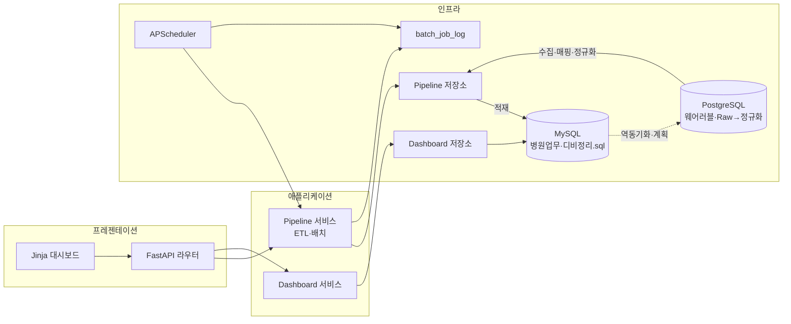

# 진료 운영 비즈니스 통계 대시보드


<br/>

<br/>

PostgreSQL(웨어러블 원천)과 MySQL(운영/분석 저장소) 간 양방향 데이터 파이프라인을 정리하기 위한 저장소입니다.<br/>
FastAPI 기반으로 5분 주기 수집 배치(PG -> MySQL), 웹서버 동기화(MySQL -> PG, 18시 기준), 실패 재처리 큐, 통계 API, Jinja2 대시보드 화면을 제공합니다.<br/>

---

## 요구 사항

### 런타임

- Python 3.10 이상 권장.
- pip 로 `requirements.txt` 패키지를 설치할 수 있는 환경.

### 데이터베이스

- MySQL 8.4, 기본 포트 3306.
- PostgreSQL(웨어러블·ETL 연계용). 호스트·DB 이름은 MySQL과 동일 키(`DATABASE_HOST`, `DATABASE_NAME`)를 쓰고, 전용 포트·계정은 `.env.example` 의 `POSTGRES_*` 를 참고합니다.
- 사용자 인증이 **`caching_sha2_password`** 일 때 PyMySQL 이 RSA 핸드셰이크에 **`cryptography`** 패키지를 씁니다. `requirements.txt` 에 넣어 두었고, 패키지만 골라 깔았다면 `pip install cryptography` 로 보강하면 됩니다.
- 스키마는 `scripts/디비정리.sql`(MySQL), `scripts/디비정리PostgreSql.sql`(PostgreSQL) 과 일치해야 합니다.<br/>
  애플리케이션은 연결 문자열에서 지정한 데이터베이스 이름 예시로 `finsight2` 를 사용합니다.<br/>
- 앱에서 쓰는 DB 계정은 해당 데이터베이스에 `SELECT`, `INSERT` 등 필요한 권한이 있어야 합니다. <br/>
  최초 스키마 생성은 관리 계정으로 `scripts/apply_schema.py` 를 실행하는 흐름을 가정합니다. `batch_job_log` 는 앱 기동 시에도 없으면 자동 생성합니다.

### 네트워크

- 로컬에서만 쓸 때는 MySQL 과 앱이 같은 머신에 있으면 됩니다.
- 서버에 올릴 때는 방화벽에서 앱 리스닝 포트와 MySQL 포트 접근 정책을 맞춥니다.

---

## 아키텍처 요약

### 레이어 구조

클린 아키텍처에 가깝게 네 구역으로 나눴습니다. 안쪽은 비즈니스 규칙과 인터페이스, 바깥은 프레임워크와 DB 구현입니다.

| 계층         | 역할                                             | 이 저장소의 위치      |
| ------------ | ------------------------------------------------ | --------------------- |
| 도메인       | 열거형, 집계 모델, 저장소 포트 프로토콜          | `app/domain/`         |
| 애플리케이션 | 유즈케이스 조립, 파이프라인·대시보드 서비스      | `app/application/`    |
| 인프라       | 설정, SQLAlchemy, MySQL 저장소 구현, APScheduler | `app/infrastructure/` |
| 프레젠테이션 | FastAPI 앱, 라우터, Jinja 템플릿, 의존성 주입    | `app/presentation/`   |

의존성 방향은 **프레젠테이션 → 애플리케이션 → 도메인** 이고, 인프라는 포트를 구현해 애플리케이션에 주입합니다.

### 구성 요소

- **`app/presentation/main.py`**: FastAPI 앱 생성, 라우터 마운트, 수명 주기 안에서 엔진·세션 팩토리와 주간 스케줄러를 붙입니다.
- **`app/presentation/dependencies.py`**: 요청별 DB 세션과 파이프라인·대시보드 서비스 조립.
- **`app/infrastructure/repositories/pipeline_mysql.py`**: 초기 배치와 완료·실패 샘플 배치의 `INSERT` 로직.
- **`app/infrastructure/repositories/dashboard_mysql.py`**: 대시보드용 읽기 전용 집계 SQL.
- **`app/infrastructure/repositories/batch_job_log.py`**: 배치 실행 이력, 실패 상태, 다음 재처리 시각을 저장하는 운영 로그.
- **`app/infrastructure/scheduler.py`**: APScheduler 로 매주 지정 요일의 두 시각에 배치 실행. OS 크론 대신 프로세스 안에서 도는 형태입니다.
- **`scripts/apply_schema.py`**: MySQL/PostgreSQL 스키마 SQL을 순서대로 실행합니다.

### 데이터·요청 흐름

1. **주간 배치**  
   스케줄러가 `PipelineJob` 에 따라 저장소 메서드를 호출하고, 동일 진입점은 `POST /pipeline/run/{job}` 으로 수동 재현할 수 있습니다.<br/>
   초기 배치는 마스터·환자 쪽 행을, 오후 계열 배치는 접수·진료·처방의 완료·취소 패턴 샘플을 넣습니다.<br/>

2. **대시보드**  
   브라우저는 `/dashboard` HTML 을 받고, 클라이언트 스크립트가 `GET /api/dashboard/stats` 로 JSON 집계를 가져와 차트를 그립니다.<br/>
   집계는 `treatments`, `department`, `examination` 계열 테이블을 읽습니다.

3. **설정**  
   `pydantic-settings` 가 `.env.example` 등을 읽어 접속 문자열과 스케줄 요일·시각을 결정합니다.

4. **실패 재처리**  
   수동/API/스케줄러로 실행한 배치는 `batch_job_log` 에 `RUNNING → SUCCESS/FAILED` 로 기록됩니다.<br/>
   실패 시 `next_retry_at` 이 잡히고, 재처리 스케줄러가 due 상태의 실패 건을 `retry` 실행으로 다시 호출합니다.



PostgreSQL 쪽은 **Raw 수집(JSON 등 원본)** → **정규화**(예: `patient_no`, `measured_at`, `metric_type`, `value`, `unit`) → 필요 시 **서비스·집계** 순으로 두고, 배치 ETL로 MySQL 운영 스키마(`디비정리.sql`)와 연결하는 방향입니다.  
예시 metric: `heart_rate_bpm`, 혈압(수축/이완), `body_temp_c`, `stress_score`, `spo2_pct`, `steps` 등.  
현재 스키마는 병원 업무(환자·접수·진료·처방·검사·통계) 중심이라 웨어러블 수치와 컬럼이 바로 맞지 않으며, 화면 항목 수준의 생체신호는 `Patient`에 넣기보다 **별도 측정 테이블**(예: vital 계열)을 두고 매핑하는 편이 안전합니다.

### 디렉터리 개요

```text
app/
  domain/           도메인 모델·포트
  application/      유즈케이스 서비스
  infrastructure/   DB·설정·스케줄러
  presentation/     main, routers, templates
scripts/            스키마 적용 스크립트
scripts/디비정리.sql MySQL DDL·주석 정리본
scripts/디비정리PostgreSql.sql PostgreSQL DDL·주석 정리본
requirements.txt    Python 의존성
.env.example        환경 변수 예시
```

---

## 실행 메뉴얼

### 공통 준비

1. 저장소를 클론하거나 받은 디렉터리로 이동합니다.

2. 가상 환경을 쓰는 것을 권장합니다.

   ```bash
   python -m venv .venv
   .venv\Scripts\activate
   ```

3. 패키지를 설치합니다.

   ```bash
   pip install -r requirements.txt
   ```

4. 저장소 **루트** 의 `.env.example` 을 참고해 접속 정보를 맞춥니다. 현재 설정 로더는 프로젝트 루트의 `.env.example` 을 읽습니다. `DATABASE_USER` 가 `root` 가 아니면 `DATABASE_PASSWORD` 를 채웁니다.

5. 최초 한 번 관리 계정으로 스키마를 적용합니다. 대상 호스트와 DB 이름은 환경에 맞게 바꿉니다.

   ```bash
   python scripts/apply_schema.py --dialect mysql --create-database --host 127.0.0.1 --port 3306 --user root --password "관리자비밀번호" --database finsight2
   python scripts/apply_schema.py --dialect postgres --host 127.0.0.1 --port 5433 --user postgres --password "관리자비밀번호" --database finsight2
   ```

   기존 MySQL 스키마에 배치 로그만 추가하려면 `scripts/add_batch_job_log.sql` 만 적용해도 됩니다. 이후 앱용 사용자에게 `finsight2` 에 대한 적절한 권한을 부여합니다.

---

### 서버 배포 실행

운영에서는 보통 재기동용 `--reload` 를 끕니다. 워커 수와 타임아웃은 트래픽에 맞게 조정합니다.

```bash
uvicorn app.presentation.main:app --host 0.0.0.0 --port 8000 --workers 2
```

## 참고 링크

| 항목      | 경로 또는 URL 패턴         |
| --------- | -------------------------- |
| 헬스 확인 | `GET /health`              |
| OpenAPI   | `/docs`, `/openapi.json`   |
| 통계 JSON | `GET /api/dashboard/stats` |
| 배치 로그 | `GET /api/dashboard/batch-job-logs` |
| 실패 재처리 | `POST /api/dashboard/batch-job-logs/retry-due` |
